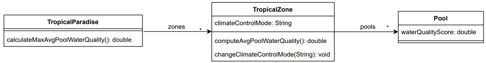
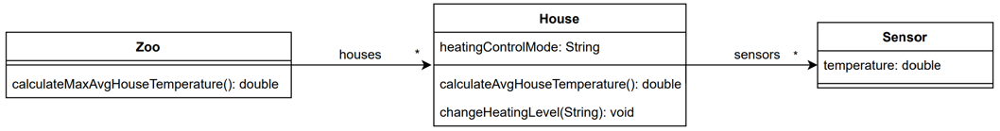
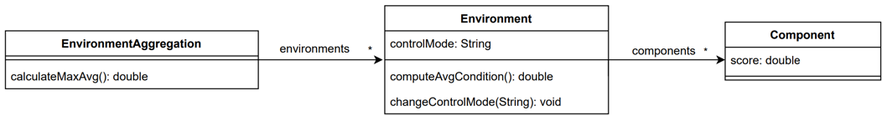

## Exam Variants Testing Pattern

## Problem Statement:

Creating multiple versions of an exam to mitigate cheating (e.g., by creating different story lines) often necessitates extensive code modifications for the automated tests. This traditional approach leads to:

* **Increased maintenance burden:** Modifying multiple test files for each exam version is time-consuming and error-prone, increasing the risk of introducing unintended changes.
* **Reduced code clarity:** Scattered modifications across various files make it difficult to understand and maintain the overall test logic.
* **Difficulties in code review:** Senior instructors face challenges in effectively reviewing numerous, potentially subtle, changes across multiple files, increasing the likelihood of overlooked errors.

### Rationale:

This pattern aims to address these challenges by promoting a more maintainable and efficient approach to creating and managing exam variations. A key compenet of this pattern is a so called "Constant" file. By centralizing schema-specific configurations and abstracting test logic, this pattern:

* **Minimizes code duplication:** Reduces the need for redundant code across different exam versions, improving code readability and maintainability.
* **Simplifies code changes:** Enables the creation of new exam versions with minimal code modifications, often requiring only a single configuration change.
* **Enhances code review:** Facilitates easier and more efficient code reviews by focusing changes to a single, well-defined location.
* **Improves code reusability:** Promotes the creation of reusable and adaptable test components that can be easily adapted to different exam schemas.

### Pattern Description:

This pattern advocates for a "bottom-up" approach to implementing schema-agnostic testing. Begin with an existing exam version with complete and functional tests. This serves as a foundation for refactoring the code to isolate schema-specific logic and introduce abstraction layers. The goal is to achieve a state where only a single modification to the testing source code is needed to test a different schema.

Consider a system managing a tropical paradise (resort) with multiple zones (e.g., `TropicalZones`). Each zone can have multiple pools (`Pool`), and each pool has a water quality score. The core functionality of the system revolves around calculating water quality scores for different pools and zones. These methods would naturally be part of an exam exercise that must be tested.



For an exam, different storylines might be created for the exercise, leading to variations in class and method naming schemes, such as the following:



The key challenge addressed by this pattern is to eliminate the need for manual updates to every test file whenever class or method names change. This pattern ensures that tests remain independent of specific names, making them more adaptable and easier to maintain in the long run.

**Achieving Schema-Agnostic Tests**

This is achieved by introducing a centralized "**Constants**" file. This file acts as a repository for all class names, methods, and attributes used in the exam. Depending on the chosen exam schema, these names are dynamically inserted into the tests at runtime. This approach fosters flexibility and significantly reduces the need for manual modifications.

To implement this pattern, the first step involves generalizing the problem statement of the exam and identifying core class names and methods. In the above example, the following generalization can be applied:



**Directory Structure Changes**

The directory structure **changes as follows:**

* **Traditional:**

```
test/
├── TropicalParadiseBehaviorTest.java
├── TropicalZoneBehaviorTest.java
├── PoolBehaviorTest.java
├── ...
```
* **Schema-Agnostic:**

```
test/
├── EnvironmentAggregationBehaviorTest.java
├── EnvironmentBehaviorTest.java
├── PoolBehaviorTest.java
├── Contstants.java
├── ...
```

**Labeling Schemas and Variants**

Label all exam schemas/versions and establish a mapping between a number and its corresponding variant. In this testing pattern, a `variant` variable is introduced and stored in the **Constants** file. This is the only line of code that differs between test suites for different schemas. The assigned number in the `variant` variable determines which exam version is tested.

The initial structure of the **Constants** file should look like this:

``` java
public class Constants {
    public static int variant = 1;
}
```

**Generalizing Behavior Tests for Schema Agnosticism**

Now, let's delve into how to modify behavior tests within the testing repository to achieve schema independence. This involves ensuring the tests function correctly regardless of specific class, variable, or method names. Instead, they should rely solely on the `variant` variable stored in the **Constants** file.

Now, for every behavior test in the testing repository, the test must be generalized such that in can be independent of the class/variable/method name and 
only depends on the `variant` variable in the constant file. 

**Generalizing Object Creation**

Let's take creating an object as an example using the `ReflectionUtils` test class. In the traditional approach, this might look like the following (assuming `TropicalZone has a constructor with two parameters):

```java
private final Class<?> tropicalZoneClass = ReflectionTestUtils.getClazz("de.tum.cit.aet.TropicalZone");
private final Constructor<?> tropicalZoneConstructor = ReflectionTestUtils.getConstructor(tropicalZoneClass);
private final Object tropicalZoneObject = ReflectionTestUtils.newInstance(tropicalZoneConstructor, INITIAL_LEVEL, new ArrayList<>());
```

This code snippet suffers from a maintainability issue. If there are many objects to be created for different schemas, manually updating the class name string (`"de.tum.cit.aet.TropicalZone"`) for each variant becomes error-prone.

The **Constants** file comes to the rescue in this scenario. By leveraging the `variant` variable, we can eliminate the need for manual string replacements across repositories. Here's the refactored code:

```java
private final Class<?> environmentClass = ReflectionTestUtils.getClazz(Constants.environmentClassPath(Constants.variant));
private final Constructor<?> environmentConstructor = ReflectionTestUtils.getConstructor(environmentClass);
private final Object environmentObject = ReflectionTestUtils.newInstance(environmentConstructor, INITIAL_LEVEL, new ArrayList<>());
```

**Constants File Implementation**

The **Constants** file is extended to include the `environmentClassPath` method, which maps the `variant` value to the corresponding class path:

```java
public static String environmentClassPath(int version) {
        return switch (version) {
            case 1 -> "de.tum.cit.aet.House";
            case 2 -> "de.tum.cit.aet.IceHockeyTeam";
            case 3 -> "de.tum.cit.aet.TropicalZone";
            default -> ""; 
        };
    }
```

**Generalizing Method Creation & Invocation**

Not only object creation, but also method creation and invocation can be generalized.

* **Traditional:**
```java
private final Method computeAvgPoolWaterQuality = getMethod(tropicalZoneObject, "computeAvgPoolWaterQuality");

@PublicTest
void calculateAvgTropicalZonePoolQualityWithZeroPoolsTest(){
    if((double) ReflectionTestUtils.invokeMethod(tropicalZoneObject, computeAvgPoolWaterQuality) != 0.0){
        fail("You did not handle the case correctly when there are zero of pools.");
    }
}
```

* **Schema-Agnostic:** 

```java
private final Method calculateAverageMethod = getMethod(environmentObject, Constants.environmentClassAverageMethod(Constants.variant));

@PublicTest
void calculateAvgEnvironmentWithZeroComponentsTest(){
    if((double) ReflectionTestUtils.invokeMethod(environmentObject, calculateAverageMethod) != 0.0){
        fail("You did not handle the case correctly when there are zero of " + Constants.componentObject(Constants.variant)+ ".");
    }
}
```

A more complete example can be found in the `example_01` directory, where an entire exam exercise is implemented using a **Constants** file.

## Implementation Considerations
* Begin with a concrete testing repository and gradually extract schema-specific elements into a **Constants** file. Attempting to design a fully generic structure from the outset can be challenging and counterproductive.
* This design allows variables to reference different class types dynamically as well.

## Summary

This pattern ultimately contributes to a more streamlined and robust development process for creating high-quality, secure, and maintainable automated exam variants.